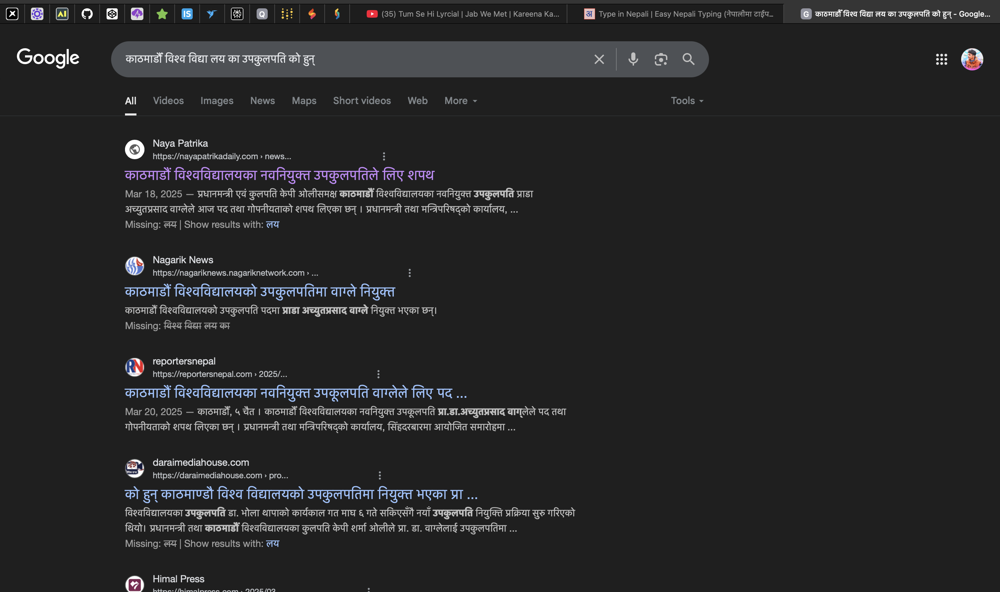

# MultiAgent_RAG
## Semantic_WebSearch

A sophisticated multilingual semantic search engine that uses AI to provide highly relevant search results and comprehensive summaries. Built with Streamlit, powered by Google's Gemini AI, and supporting both English and Nepali languages.

## Features

- **Semantic Search**: Uses AI to understand query context and meaning
- **Multilingual Support**: Full support for English and Nepali
- **Smart Ranking**: AI-powered relevance scoring and document ranking
- **Comprehensive Summaries**: Generates detailed summaries from highly relevant sources
- **Social Media Filtering**: Automatically filters out social media noise
- **Responsive UI**: Clean, modern interface with dark mode
  
## Demo

<details>
<summary>Click to view screenshots</summary>

### English Search Results


### Google Search Results


### Nepali Search Results


### Google Search Results



</details>

##  Technology Stack

- **Frontend**: Streamlit
- **AI/ML**: 
  - Google Gemini AI
  - Sentence Transformers
  - BeautifulSoup4 for web scraping
- **Search**: Google Custom Search API
- **Language Processing**: Custom NLP pipelines
- **Async Processing**: asyncio for concurrent operations

## Prerequisites

- Python 3.9+
- Google AI Studio API key
- Google Custom Search API key
- Google Search Engine ID

## Installation

1. Clone the repository:
```bash
git clone https://github.com/yourusername/semantic-search.git
cd semantic-search
```

2. Create and activate virtual environment:
```bash
python -m venv venv
source venv/bin/activate  # On Windows: venv\Scripts\activate
```

3. Install dependencies:
```bash
pip install -r requirements.txt
```

4. Create a `.env` file in the project root:
```env
GOOGLE_API_KEY=your_google_api_key
GOOGLE_SEARCH_ENGINE_ID=your_search_engine_id
GOOGLE_AI_STUDIO_KEY=your_gemini_api_key
```

##  Usage

1. Start the application:
```bash
streamlit run app.py
```

2. Open your browser and navigate to `http://localhost:8501`

3. Enter your search query in either English or Nepali

4. View results including:
   - Comprehensive summary
   - Highly relevant documents (80%+ relevance)
   - Related documents
   - Source links

## Project Structure

```
semantic-search/
├── app.py                 # Main Streamlit application
├── semantic_processor.py  # Semantic processing and AI logic
├── search_engine.py      # Search engine integration
├── web_scraper.py        # Web scraping functionality
├── requirements.txt      # Project dependencies
└── .env                  # Environment variables
```

## 🤖 How It Works

1. **Query Processing**:
   - Analyzes query semantics using Gemini AI
   - Translates between English and Nepali as needed

2. **Search and Retrieval**:
   - Performs semantic search using Google Custom Search
   - Filters out social media and low-quality sources
   - Scrapes and processes web content

3. **Content Processing**:
   - Ranks documents using AI-powered relevance scoring
   - Generates comprehensive summaries from high-relevance content
   - Handles domain-specific content (e.g., e-commerce sites)

4. **Result Presentation**:
   - Displays AI-generated comprehensive summary
   - Shows highly relevant documents (80%+ relevance)
   - Lists other related documents
   - Provides source links and relevance scores


##  Contributing

Contributions welcome! Please feel free to submit a Pull Request.


##  Acknowledgements

- Google Gemini AI
- Sentence Transformers
- Streamlit
